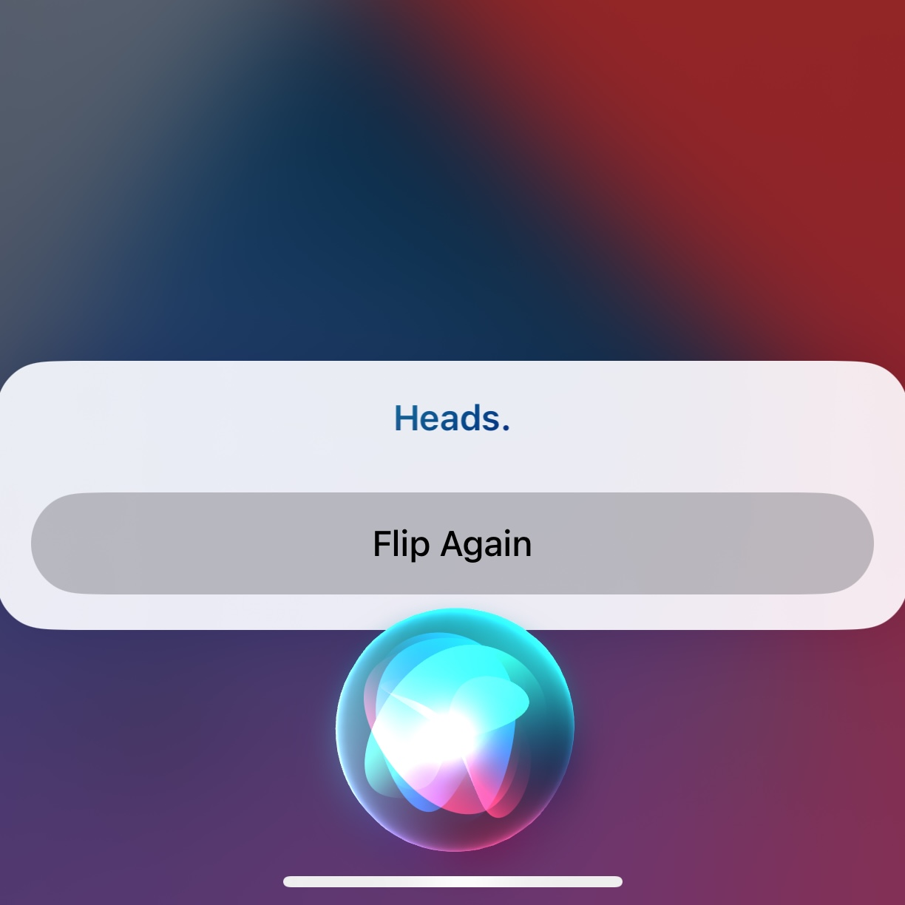
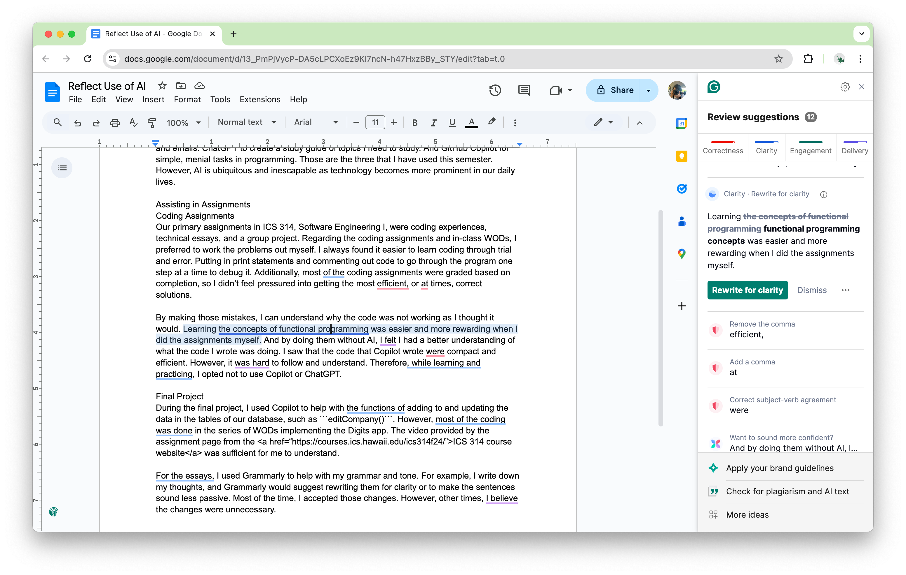

“Hey, Siri. Flip a coin.” The words I say to help me make simple day-to-day decisions. And Siri is just one of many tools we have available to us. As a student, I have used Grammarly, ChatGPT, and GitHub Copilot to help with my studies. Grammarly helps me with grammar in my essays and emails. ChatGPT to create a study guide of topics I need to study. And GitHub Copilot for simple, menial tasks in programming. Those are the three that I have used this semester. However, AI is ubiquitous and inescapable as technology becomes more prominent in our daily lives.

## Assisting in Assignments


#### Coding Assignments
Our primary assignments in ICS 314, Software Engineering I, were coding experiences, technical essays, and a group project. Regarding the coding assignments and in-class WODs, I preferred to work the problems out myself. I always found it easier to learn coding through trial and error. Putting in print statements and commenting out code to go through the program one step at a time to debug it. Additionally, most of the coding assignments were graded based on completion, so I didn’t feel pressured into getting the most efficient, or at times, correct solutions.

By making those mistakes, I can understand why the code was not working as I thought it would. Learning the concepts of functional programming was easier and more rewarding when I did the assignments myself. And by doing them without AI, I felt I had a better understanding of what the code I wrote was doing. I saw that the code that Copilot wrote were compact and efficient. However, it was hard to follow and understand. Therefore, while learning and practicing, I opted not to use Copilot or ChatGPT.

#### Final Project
During the final project, I used Copilot to help with the functions of adding to and updating the data in the tables of our database, such as ```editCompany()```. However, most of the coding was done in the series of WODs implementing the Digits app. The video provided by the assignment page from the <a href=“https://courses.ics.hawaii.edu/ics314f24/”>ICS 314 course website</a> was sufficient for me to understand.

#### Writing with AI

For the essays, I used Grammarly to help with my grammar and tone. For example, I write down my thoughts, and Grammarly would suggest rewriting them for clarity or to make the sentences sound less passive. Most of the time, I accepted those changes. However, other times, I believe the changes were unnecessary or took out the “humanness” of the writing. I like the repetition. I like the uncertainty of the tone sometimes. Or sometimes, a phrase is all we need to say to convey something.

## Net-Positive Effect
### Influence on Learning Experience
Overall, the use of AI as a student has had a net positive effect on my learning. It has helped me with the correctness of my essays. Be it grammar and punctuation or phrasing for clarity or engagement. While I found it more helpful to not use AI while learning concepts in my classes, I have used it to create study to reinforce the concepts that I have learned. For example, I have a list of the concepts I want to study in chemistry or my machine learning class. So I can ask for a summary or overview of those concepts.

### Applications: In and Outside of the Classroom
As stated previously, I have used ChatGPT to help create study guides for other classes. Additionally, Siri is there to help with anything. For example, flipping a coin or rolling a dice to help make decisions. For example, should I do chemistry homework or math homework? Should I attend or not attend? Something more entertaining. “Hey, Siri. Tell me a joke.” On more useful topics, AI can be used in translating languages in real time or used in machine learning for image or speech recognition and other things. They can also be used in vehicles such as airplanes and cars.

Furthermore, AI is even used in educational tools like Pearson. In Pearson, there is an AI chatbot that can guide students on how to solve the problems. There are also dynamic modules that provide the students with questions and problems based on the content covered in the textbook. The students get questions based on which questions they get right or wrong. The use of AI is helping students with their learning. It might not be traditional. However, it is more convenient and efficient because instead of everyone learning at the same pace, students can have a tailored learning environment to help them with their own learning. To have more pracitce with what they have yet to master or an AI to help them guide them in their studies.

## Challenges and Opportunities
As stated above, Copilot can produce code that is more efficient and compact than the code I would write. It is an opportunity to learn how to write this kind of code. The type that takes the least amount of time and uses the least amount of memory. However, it also poses the challenge that the code is hard to understand and hard to replicate without learning what it actually does.

This leads us to the next challenge: did I truly learn the concepts? Yes, the use of AI can get you the grade and points needed to “show” that you understand. However, if Copilot or ChatGPT or some other AI did it for you, is there a need to understand the concept? With the use of AI, it is difficult to fight the urge just to have AI do your assignments and turn them in, especially, when the professor encourages you to use these tools.

But that is different for everyone. Others find it useful, while others prefer a more independent approach. Others can start at a given starting point, while others can spend hours on square one. In my experience, learning for me is easier when I do things myself. However, when I have a strong foundation, I look forward to using these tools to make life easier and develop my understanding in software engineering and other subjects.
