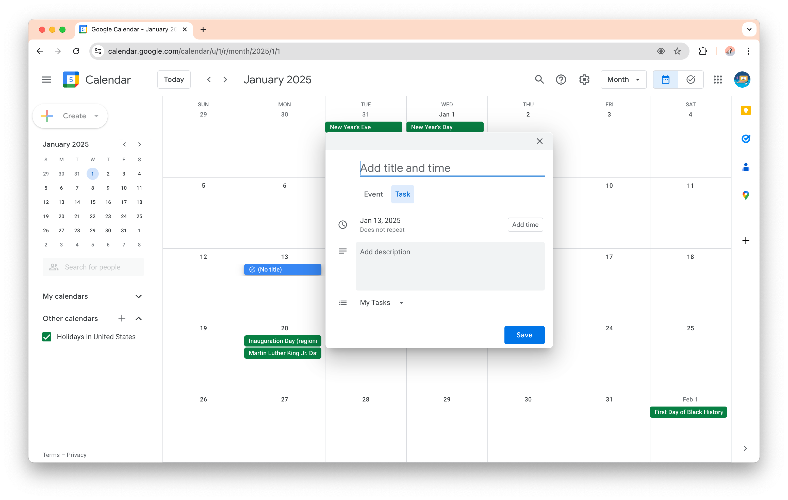
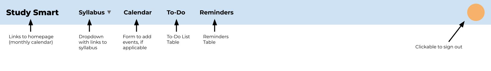

## Overview
Laulima is where students look to find reminders, due dates of assignments, and other important information. However, it is all divided into individual classes. To simplify it, a student planner application can be created to combine everything. All essential dates are on one calendar. All assignments needing completion are on a single to-do list, which can be sorted based on due date or filtered based on class.

## Approach
The home page will be a monthly calendar. However, when logged in, the calendar will be populated with events associated with the user (class schedule, meetings, due dates, exam dates) which will be color-coded. The way the events can be added to the calendar can be implemented using a form where the user inputs the event and its category or clicking on the dates on the calendar prompting the use what event should be added for chosen date, similar to the Google Calendar.

The navigation bar will have a dropdown menu that links to all the necessary syllabi, like the bookmarks bar of a web browser, a To-Do List, and Reminders. The To-Do List and Reminders page will have a table which will have a button to add things to the table. The tables’ columns will be clickable to sort the rows in some order (alphabetically, due date, points/importance). A search bar can also be added to filter out the table for a certain entry.

## Case Ideas
The student planner application can be tested by UH Manoa students, where they can add to the calendar of important dates, access all the syllabi of their classes in one place, add and check items on a to-do list, and add reminders.

## Beyond the Basics
After implementing the planner aspect, we can level up the calendar by using the Google Calendar API to connect the Google Calendar associated with the user’s Gmail account.
