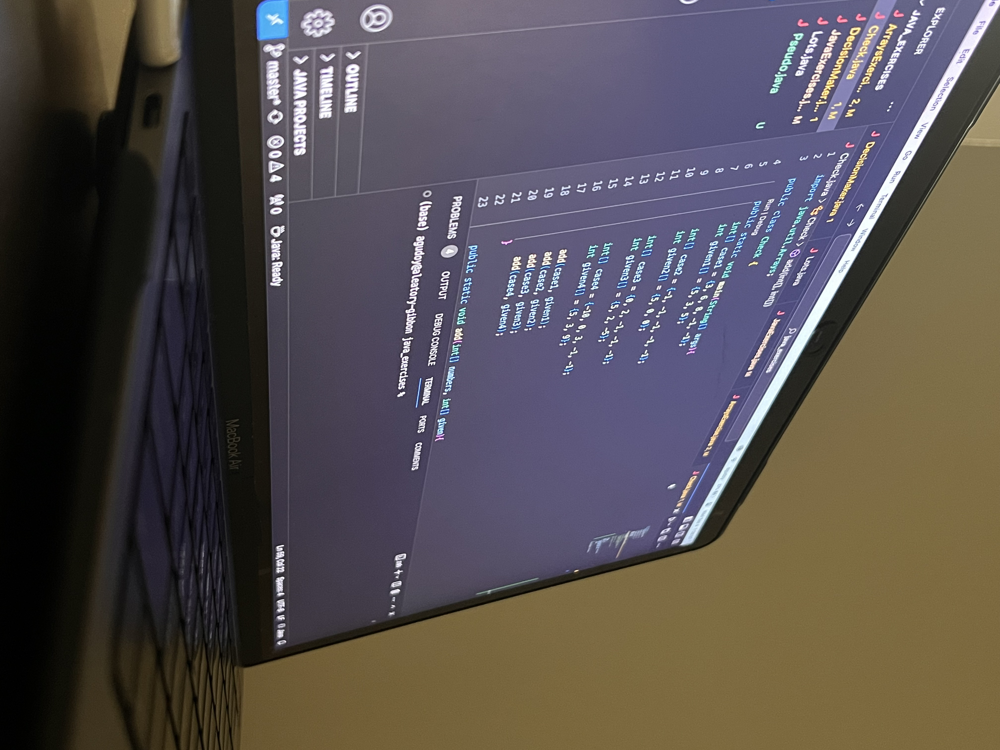
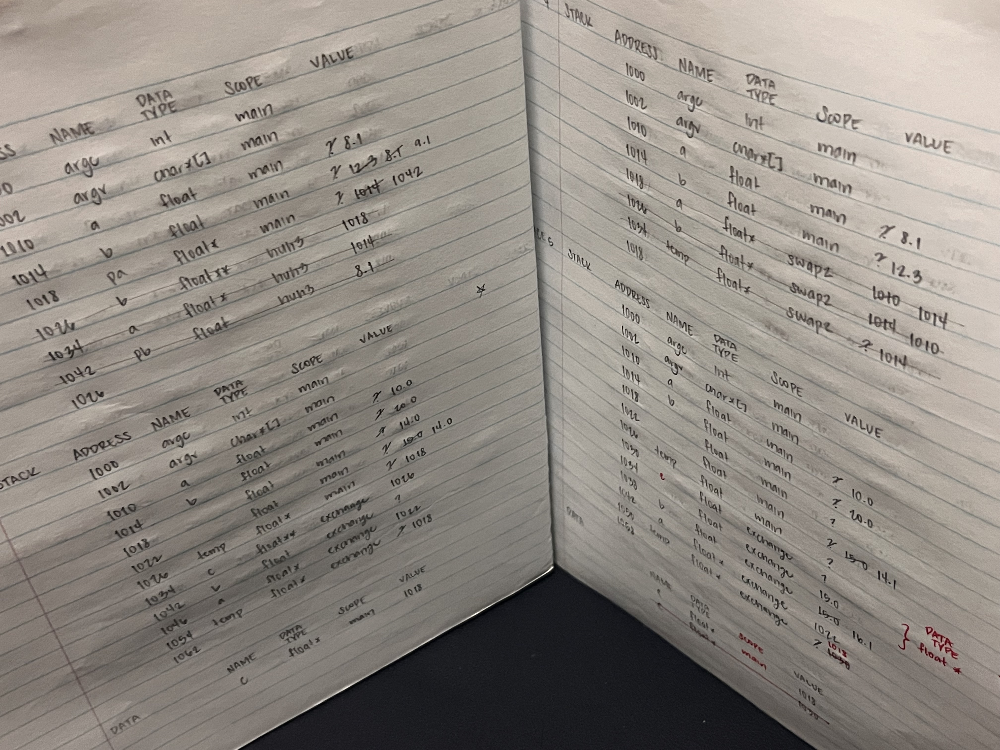

## How It All Started

I have come a long way in my path to becoming a software engineer. I remember when I was walking at an empty high school campus going to a summer programming camp for robotics. It was the first time I had ever tapped into anything computer science-related. I sat in a chair staring blankly at the slides the senior programmers were sharing to teach us the basics of Java. Then, throwing an exercise at us. The dreaded print “Hello world!” Without any programming experience and not understanding what they had just said, I stared at the computer right in front of me, not thinking to look up at the slides to see the example they had provided. But once I saw the resemblance of the code I wrote and the one they had shown, everything seemed to click.

To not be a burden in robotics, I took all the available computer science classes in high school. However, that made me more invested in computer science, and led me to pursue a degree in computer science. During summer camp, I followed the “Monkey see, monkey do” strategy. I paid close attention to the examples they showed us and connected everything together as I programmed. To this day, I continue learning about what I was typing. I understood better what they were teaching, and eventually, I understood what I was teaching as I filled their shoes when I became the programming captain in my senior year. 

## My Goals

As I continue to work on assignments and projects for classes in my pursuit of a degree, I am understanding the things that I “supposedly learned.” “Supposedly” because I can complete the exercises. I finished the tasks. But did I really understand what I did? The short answer is no, but yes. I typed from muscle memory. I looked at the generated errors, went to the problem, and fixed it. But the more practice I do and study the resources from classes and online, the more I understand what I do. From getting confused because of all the thinking I stubbornly wish to do in my head to drawing these “houses” representing variables and drawing tables to trace code, I have a better grasp of what I am writing.

In the future, I hope to improve not only my technical skills but also the skills needed to be successful in life, such as cooperation, communication, and time management. I hope to learn more about the tools I have used, the different programming languages I have yet to learn, and, most importantly, the new and innovative technologies that are continuously being improved and developed. I aim to extend my knowledge through the opportunities that are presented, applying what I have learned from my experiences and hours of lectures and practice to a problem in the world and continuously improving on the tools that have already been made available.
