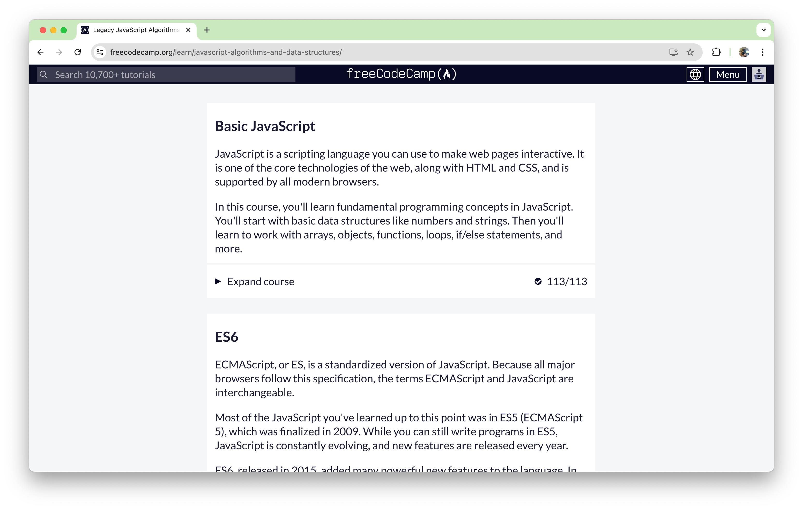

## TypeScript Experience
After learning other programming languages through robotics and courses in computer science, learning another is less overwhelming than it used to be. The same with TypeScript. The exercises under “Basic JavaScript” on the FreeCodeCamp website were a breeze. I have done JavaScript before for robotics in high school, therefore it was things that I have learned before. The later exercises, the ones under “ES6” were less familiar; however, the exercises came with examples and brief explanations, so it was not as bad as it could have been.

Because TypeScript builds on JavaScript to help improve it, learning TypeScript actually improved my understanding of JavaScript. For example, the keyword var. I was taught to declare variables using var. But later when I started working on projects, I was told to use the keywords let or const, not completely understanding the differences. Now, because of FreeCodeCamp, I finally saw why let and const needed to be introduced.

As my previous programming mentors once said, “JavaScript is weird;” it finally makes sense. Because JavaScript is ubiquitous in web development and other applications, TypeScript building on JavaScript makes it easier to find errors and more manageable. It is also advantageous because it already uses a syntax similar to JavaScript, so transitioning to TypeScript will not be starting from scratch.

## Stress in the WODS
Athletic software engineering, at the moment, the thought of it makes my heart pound. However, as the age-old saying goes, “Practice makes perfect.” Perfect may be impossible, and great is a long way to go, but with the weekly WODs (practice, group, and actual graded) that will be given this semester, it will motivate me to be better. In adaptability. In problem-solving. Even in stressful situations. Enjoyable might not be the first word that comes to mind at the moment, but looking back, I sure will laugh at the small mistakes that I will make and at the overlooked, more straightforward solutions.

Being a student for all my life, I think this style of learning works for me. I find it easier to remember what I did wrong, and in the future, when making the same mistake, I am usually good at remembering how to avoid making the same mistakes. For example, when I was doing practice exercises in Java, I got confused between the greater/less than and greater/less than or equal to when coding for loops or checking conditions. However, when I chose one instead of the other, I found it easier to understand why it was the other option. Running the code made me think more about how the inclusivity of the value worked or did not work.

We often don’t want to make mistakes, and sometimes, we end up not doing anything at all. But, as many others and experiences have taught me, it’s the mistakes that we learn from. “Fail forward,” one of my teachers used to say all the time.
