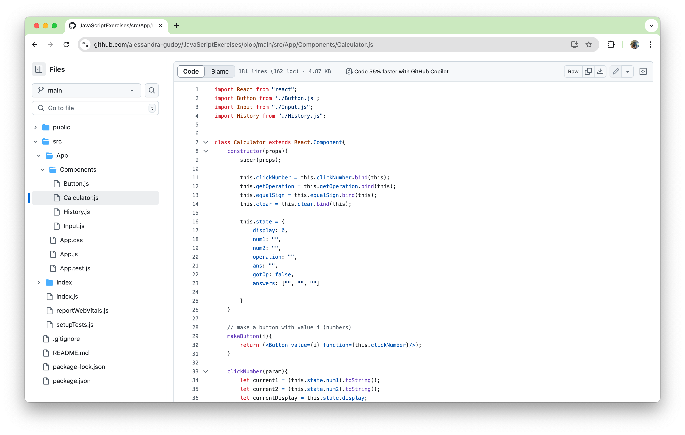

This was a calculator I made using React. During high school, I was on the Maui High School Robotics team. In my junior year, I worked with other members and our programming mentors to create a scouting app to be used during competitions where we input the performance of other teams' robots.

To create this scouting app, our programming mentors decided that it was beneficial to learn and use React. To learn about JavaScript and React, each person working on the scouting app (four of us total) was to create a calculator app. This calculator would perform basic operations such as addition, multiplication, subtraction, and division and had a history where we could see the previous calculations that were made.

From this small project, I gained a foundation in JavaScript and learned how to use React. In addition to programming, our programming mentors also introduced us to GitHub, where we could store and manage our code. This made it easier to look back on changes we made to our code and work with each other. Prior to GitHub, we would save our files in a ZIP file and upload them to Google Drive, email them to each other, or share them using a flash drive. This was one of my first projects uploaded to GitHub.

Source: <a href="https://github.com/alessandra-gudoy/JavaScriptExercises"><i class="large github icon "></i>alessandra-gudoy/JavaScriptExercises</a>
