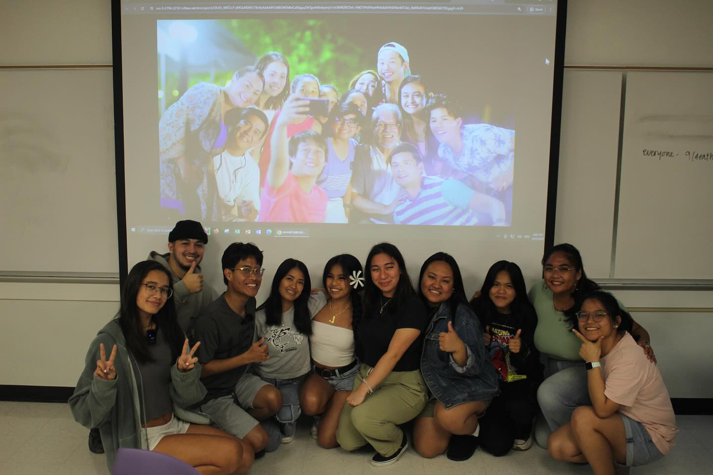

"Pitong Sabado," or Seven Sundays, was a short video based on the movie of the same name, "Seven Sundays." It was a class project to create a video submission for the Katipunan's Got Talent (KGT) event. Each class in the Filipino courses at UH Manoa was to submit a performance idea, be it a video or live performance, in the theme of the semester's KGT. During Spring 2024, the theme was "Maalaala Mo Kaya" (MMK), which translates to "Can You Remember".

Maalaala Mo Kaya is a famous TV series in the Philippines that tells the true stories of the people from letters they send in. It usually has a lesson learned and a word tied to the whole episode. Our class decided to focus on family and was inspired by the movie "Seven Sundays." My role in this project was to help write out the script and act it out, which we divided up, and help film and edit the final video.

From this project, I learned about time management and planning because we needed to coordinate when to film. I also learned how to edit using DaVinci Resolve. I have edited videos before, but using Adobe Premiere Rush, Final Cut Pro, and iMovie. However, because of my previous experiences with these editing softwares, using DaVinci Resolve was no problem. Additionally, because of our time conflicts in filming, I was working in a time crunch to put together the clips we filmed and produce a final product, teaching me to remain calm under pressure.
